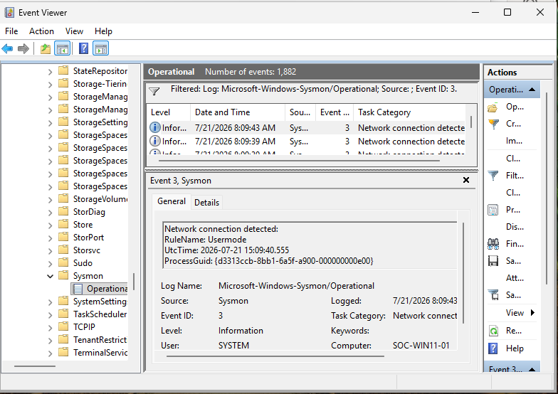
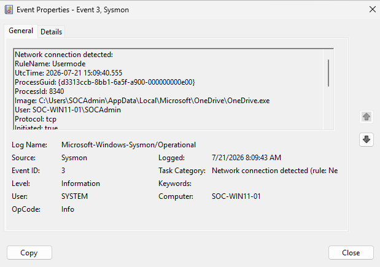
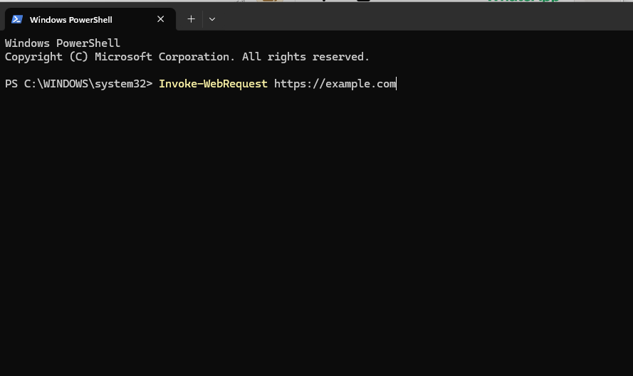
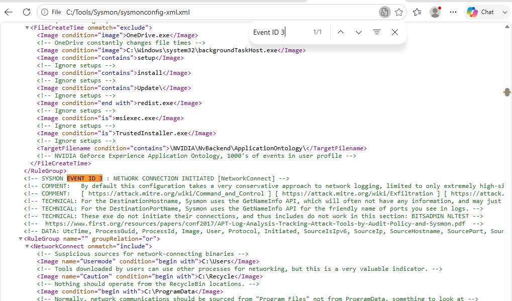

# Session 03 — Network Connection Monitoring (Event ID 3)

**Date:** 21 July 2026

---

# Objective

Investigate Sysmon Network Connection events (Event ID 3) and understand how Sysmon configuration controls network telemetry collection.

---

# Overview

This session focused on understanding how Sysmon records outbound network activity through Event ID 3.

The investigation demonstrated that Sysmon does not log every network connection by default. Instead, network telemetry depends entirely on the active Sysmon configuration and its include rules.

---

# Lab Activities

## Event ID 3 Investigation

Opened the Sysmon Operational log and filtered Event ID 3.

Investigated a legitimate network connection generated by Microsoft OneDrive.

Collected the following fields:

- Image
- User
- Protocol
- Source IP
- Destination IP
- Destination Port
- Source Hostname
- Destination Hostname

---

## PowerShell Validation

Generated an outbound network connection using PowerShell.

Expected a new Event ID 3.

No event appeared.

This behavior indicated that the monitoring configuration required further investigation.

---

## Configuration Review

Reviewed the SwiftOnSecurity Sysmon configuration.

Located the **NetworkConnect** include rules.

Confirmed that PowerShell network connections were not included in the active monitoring configuration.

---

# Screenshots

### Screenshot 01 — Event ID 3 Events

---

### Screenshot 02 — Event ID 3 Details

---

### Screenshot 03 — PowerShell Network Test

---

### Screenshot 04 — NetworkConnect Configuration Rules

---

# Skills Practiced

- Network Connection Analysis
- Event ID 3 Investigation
- Sysmon Configuration Review
- Endpoint Telemetry Validation
- PowerShell Testing

---

# Lessons Learned

- Event ID 3 records outbound network connections.
- Sysmon only logs network activity that matches the active configuration rules.
- Missing events often indicate configuration limitations rather than telemetry failures.
- Reviewing Sysmon configuration is an essential part of troubleshooting.
- Validation testing is required after every monitoring change.

---

# Session Outcome

✅ Event ID 3 successfully investigated.

✅ OneDrive network activity analyzed.

✅ PowerShell network activity validated.

✅ NetworkConnect configuration understood.

The investigation confirmed that Sysmon telemetry depends entirely on the active configuration rather than recording every network event.

---

# Next Session

- Modify the Sysmon configuration.
- Add PowerShell to the NetworkConnect include rules.
- Reload the configuration.
- Verify that PowerShell network activity is captured successfully.