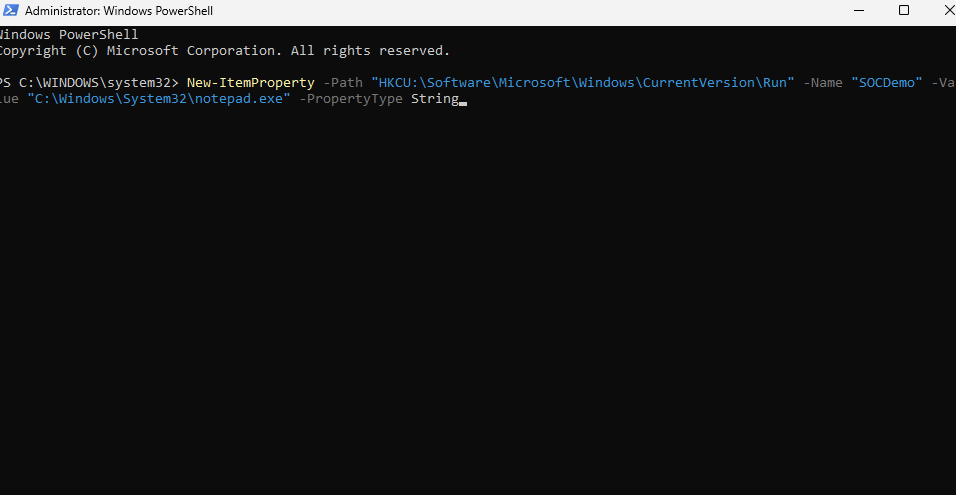
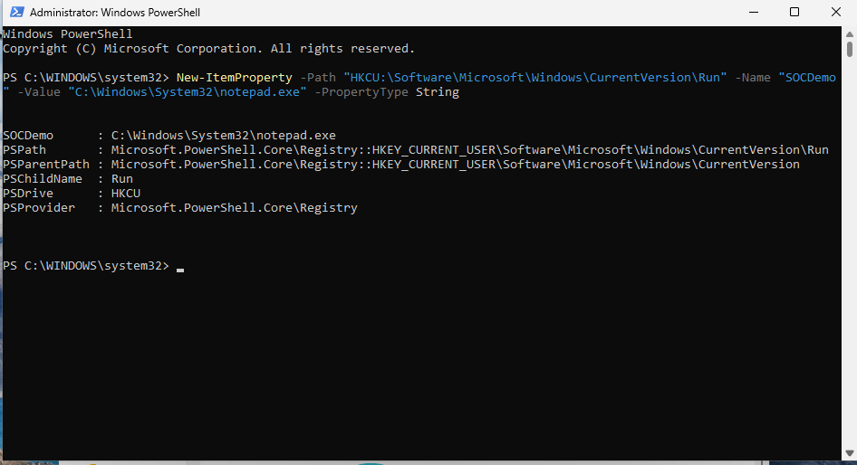
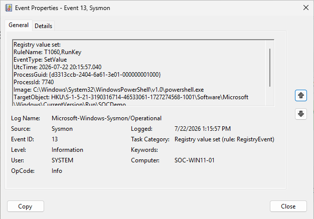

# Session 06 — Registry Monitoring (Event ID 13)

**Date:** 22 July 2026

---

# Objective

Investigate Sysmon Registry monitoring by validating Event ID 13 and understanding how Windows Registry persistence techniques can be detected using endpoint telemetry.

---

# Overview

This session focused on one of the most common persistence mechanisms used by attackers: the Windows Registry.

A Registry value was created using PowerShell to simulate persistence activity. Sysmon successfully detected the modification as Event ID 13, allowing the investigation to capture the process responsible, the Registry location, and the value written.

---

# Lab Activities

## Configuration Review

Reviewed the Sysmon **RegistryEvent** configuration.

Identified monitored Registry locations associated with Windows persistence.

Studied how attackers commonly abuse the **Run** Registry Key.

---

## Registry Modification

Created a Registry value named:

```
SOCDemo
```

Using PowerShell.

Generated Sysmon Event ID 13 successfully.

---

## Investigation

Reviewed Event ID 13.

Collected the following evidence:

- EventType
- Image
- TargetObject
- Details
- User
- ProcessGuid

Verified that PowerShell successfully modified the monitored Registry location.

Confirmed that the Registry modification matched the monitored Sysmon RegistryEvent rule.

---

## Documentation

Created a Registry Investigation Report.

Recorded all evidence collected during the investigation.

---

# Screenshots

### Screenshot 01 — RegistryEvent Configuration



---

### Screenshot 02 — Create Registry Value



---

### Screenshot 03 — Event ID 13 (Registry Value Set)



---

# Skills Practiced

- Registry Monitoring
- Event ID 13 Investigation
- Windows Persistence
- Sysmon Configuration Review
- PowerShell
- Evidence Collection

---

# Lessons Learned

- Event ID 13 records Registry value modifications.
- Registry Run Keys are commonly abused by attackers for persistence.
- The **TargetObject** field identifies the exact Registry path.
- The **Details** field shows the value written into the Registry.
- Registry monitoring is one of the most valuable endpoint detection techniques.

---

# Session Outcome

✅ Successfully validated Event ID 13.

✅ Investigated Registry persistence activity.

✅ Understood Registry monitoring behavior.

✅ Completed the Registry Investigation Report.

The Windows SOC Lab can now detect Registry-based persistence attempts using Sysmon telemetry.

---

# Next Session

- Perform the first complete Threat Hunting investigation.
- Correlate multiple Sysmon events.
- Reconstruct attacker activity using endpoint telemetry.