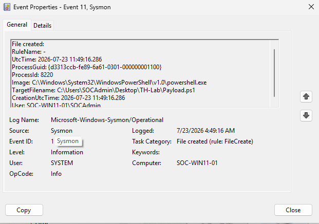
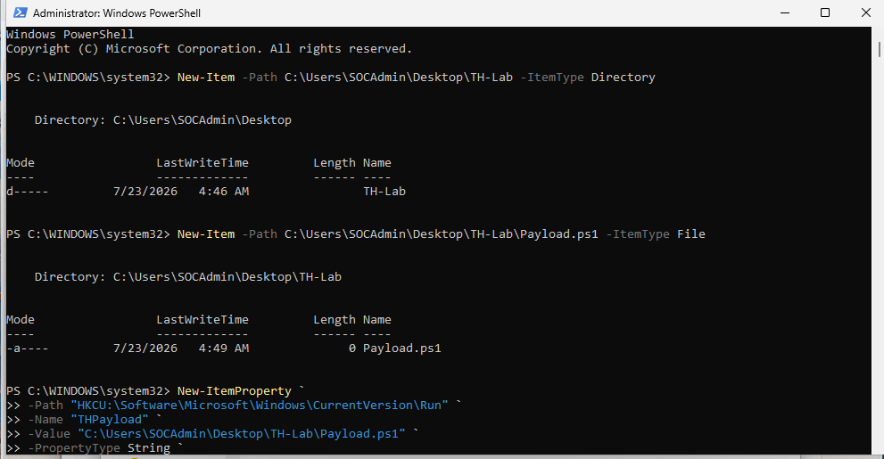
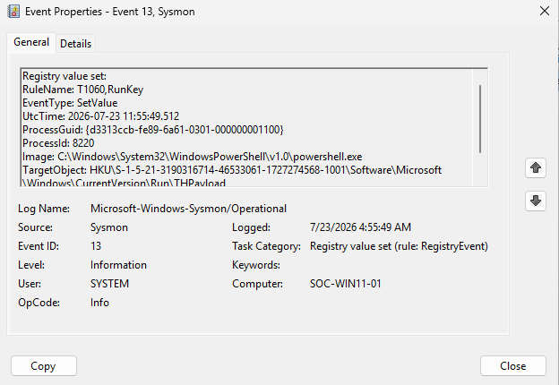

# Session 07 — Threat Hunting Investigation

**Date:** 23 July 2026

---

# Objective

Perform the first Threat Hunting investigation by correlating multiple Sysmon events to reconstruct attacker activity rather than investigating individual logs.

---

# Overview

This session introduced a complete Threat Hunting scenario that simulated common attacker behavior using PowerShell.

Instead of investigating isolated events, multiple Sysmon event types were correlated to reconstruct the complete attack timeline and determine whether the observed behavior represented a real security incident.

This investigation marked the transition from event analysis to analyst-driven threat hunting.

---

# Lab Scenario

A simulated attacker performed the following activities:

- Created a PowerShell payload.
- Established persistence using a Windows Registry Run Key.
- Generated outbound network activity.

The objective was to reconstruct the entire attack sequence using Sysmon telemetry.

---

# Investigation Process

## Step 1 — File Creation

Investigated Event ID 11.

Identified that PowerShell created:

```
Payload.ps1
```

Collected:

- Image
- TargetFilename
- User

---

## Step 2 — Registry Persistence

Investigated Event ID 13.

Identified Registry persistence:

```
HKCU\Software\Microsoft\Windows\CurrentVersion\Run\THPayload
```

Collected:

- TargetObject
- Details
- Image
- User

---

## Step 3 — Network Activity

Investigated Event ID 3.

Verified outbound HTTP communication generated by PowerShell.

Collected:

- Image
- Destination IP
- Destination Port
- User

---

## Step 4 — Timeline Reconstruction

Correlated all collected evidence using timestamps and Sysmon ProcessGuid.

Attack Timeline:

| Time (UTC) | Event ID | Description |
|------------|----------|-------------|
| 11:49:16 | 11 | PowerShell created Payload.ps1 |
| 11:55:49 | 13 | Registry Run Key (THPayload) created |
| 11:59:36 | 3 | Outbound HTTP connection generated |

---

## Step 5 — MITRE ATT&CK Mapping

Mapped the observed techniques:

| Technique | Description |
|-----------|-------------|
| T1059.001 | PowerShell |
| T1547.001 | Registry Run Keys |
| T1071.001 | Web Protocols |

---

## Step 6 — Analyst Assessment

Performed a behavioral assessment based on collected evidence.

Observed behavior:

- PowerShell execution
- File creation
- Registry persistence
- Outbound network communication

No evidence of:

- Malware execution
- Credential theft
- Privilege escalation
- Lateral movement

Final assessment:

**Risk Level:** Medium

The observed behavior was intentionally generated within the SOC lab for validation purposes and did not represent a real compromise.

---

# Screenshots

### Screenshot 01 — Event ID 11 (Payload.ps1)



---

### Screenshot 02 — Registry Persistence



---

### Screenshot 03 — Event ID 13 (Registry Value Set)



---

# Skills Practiced

- Threat Hunting
- Event Correlation
- Timeline Reconstruction
- MITRE ATT&CK Mapping
- Registry Analysis
- Network Analysis
- Incident Assessment
- Evidence Collection

---

# Lessons Learned

- Threat Hunting focuses on correlating multiple telemetry sources.
- ProcessGuid is one of the strongest artifacts for event correlation.
- Registry persistence should always be investigated alongside process activity.
- Behavioral analysis is more valuable than investigating isolated events.
- Evidence-based reasoning is essential before escalating an alert.

---

# Session Outcome

✅ Completed the first Threat Hunting investigation.

✅ Successfully correlated Event IDs 11, 13, and 3.

✅ Reconstructed the complete attacker timeline.

✅ Performed analyst-style behavioral assessment.

The Windows SOC Lab now supports full multi-event threat hunting investigations.

---

# Next Session

- Perform an analyst-driven investigation with minimal guidance.
- Correlate Process Create, File Create, and Registry events.
- Continue strengthening investigative methodology.