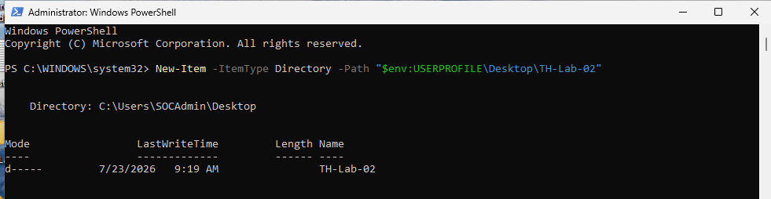
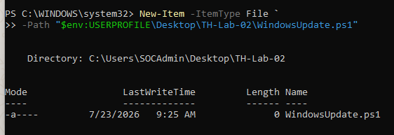
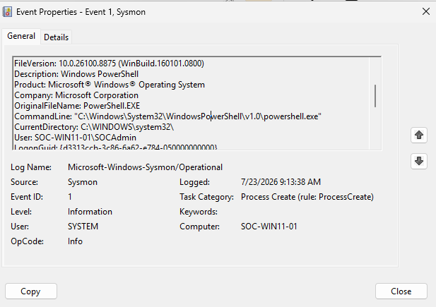
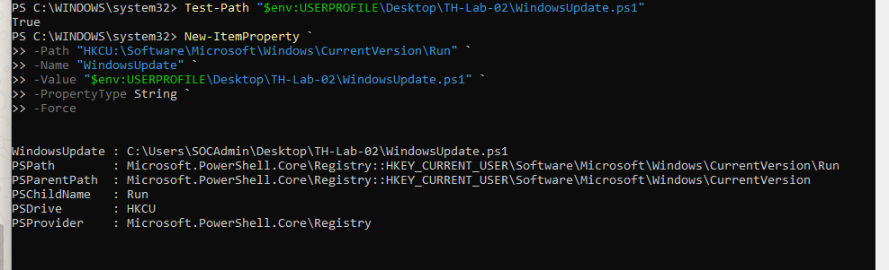
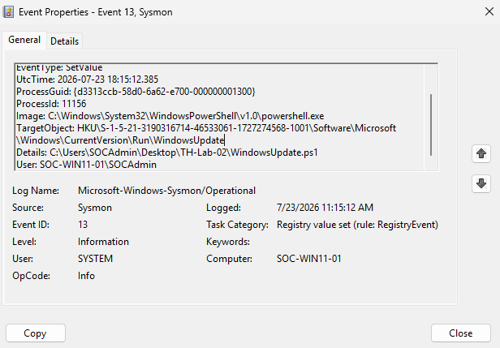

# Session 08 — Analyst-Driven Registry Investigation

**Date:** 24 July 2026

---

# Objective

Perform an analyst-driven investigation by correlating PowerShell process activity with Registry modifications to identify suspicious persistence behavior using Sysmon telemetry.

---

# Overview

This session focused on performing a Registry persistence investigation with minimal guidance.

Rather than following predefined steps, the investigation required identifying the relevant Sysmon events, correlating them using the ProcessGuid, and assessing whether the observed behavior represented malicious persistence or legitimate administrative activity.

---

# Lab Activities

## Step 1 — Generate Activity

Generated PowerShell activity by creating a PowerShell script:

```
WindowsUpdate.ps1
```

---

## Step 2 — Process Investigation

Investigated Event ID 1.

Collected:

- Image
- ParentImage
- User
- ProcessGuid

Verified that PowerShell launched from Explorer.

---

## Step 3 — File Investigation

Correlated Event ID 11 using the same ProcessGuid.

Verified that PowerShell created:

```
WindowsUpdate.ps1
```

---

## Step 4 — Registry Investigation

Generated Registry persistence using the Windows Run Registry Key.

Investigated Event ID 13.

Collected:

- UtcTime
- TargetObject
- Details
- Image
- User

Verified that the Registry Run Key referenced the PowerShell script stored on the Desktop.

---

## Step 5 — Timeline Reconstruction

Correlated Event IDs 1, 11, and 13.

Timeline:

| Time (UTC) | Event ID | Description |
|------------|----------|-------------|
| 12:18:42 | 1 | PowerShell launched |
| 12:19:07 | 11 | WindowsUpdate.ps1 created |
| 12:21:18 | 13 | Registry Run Key created |

---

## Step 6 — Analyst Assessment

Observed behavior:

- PowerShell execution
- Script creation
- Registry persistence

No evidence of:

- Network communication
- Malware execution
- Privilege escalation

Final assessment:

**Risk Level:** Medium

The Registry persistence technique resembles common attacker behavior; however, no additional malicious activity was observed.

The investigation concluded that the observed activity was intentionally generated within the SOC lab for validation and learning purposes.

---

# Screenshots

### Screenshot 01 — TH-Lab-02 Folder



---

### Screenshot 02 — Create WindowsUpdate.ps1



---

### Screenshot 03 — Event ID 1 (Process Create)



---

### Screenshot 04 — Registry Persistence



---

### Screenshot 05 — Event ID 13 (Registry Persistence)



---

# Skills Practiced

- Registry Analysis
- Event Correlation
- PowerShell Investigation
- ProcessGuid Correlation
- Timeline Reconstruction
- Behavioral Analysis

---

# Lessons Learned

- Registry persistence should always be correlated with process activity.
- ProcessGuid provides reliable evidence across multiple Sysmon events.
- Legitimate-looking filenames should never be trusted without investigation.
- Evidence-based analysis is essential before classifying an alert as malicious.

---

# Session Outcome

✅ Successfully correlated Event IDs 1, 11, and 13.

✅ Identified Registry persistence activity.

✅ Completed an analyst-driven investigation.

✅ Produced evidence-based conclusions.

---

# Next Session

- Investigate simulated SOC alerts.
- Start investigations without prior knowledge of attacker activity.
- Build complete incident timelines from endpoint telemetry.