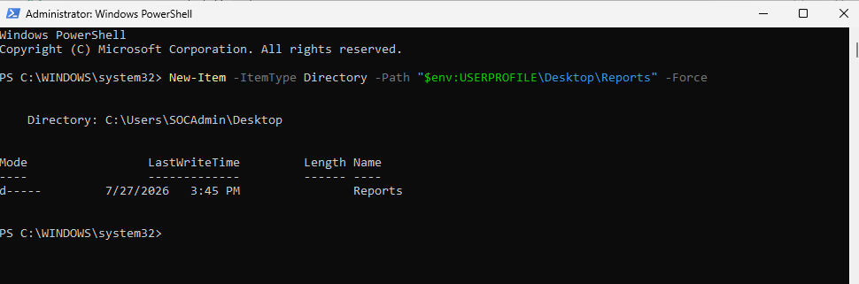
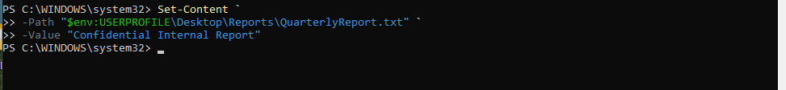
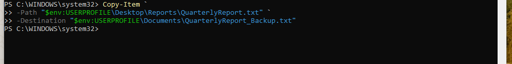
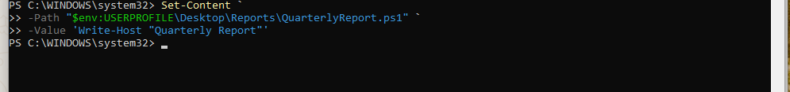
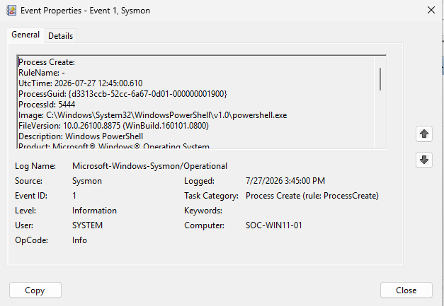
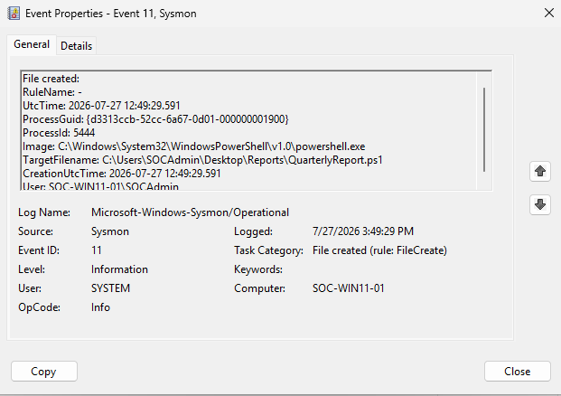

# Session 09 — PowerShell File Activity Investigation (SOC-0001)

**Date:** 27 July 2026

---

# Objective

Investigate PowerShell file creation activity by correlating Sysmon Process Creation and File Creation events to determine whether the observed behavior represents malicious or legitimate activity.

---

# Overview

This session introduced the first simulated SOC alert (SOC-0001).

The investigation focused on reconstructing PowerShell activity by correlating multiple Sysmon events and determining whether the generated file activity required incident escalation.

The investigation followed a standard SOC workflow consisting of evidence collection, event correlation, timeline reconstruction, and final analyst assessment.

---

# Lab Activities

## Step 1 — Generate PowerShell Activity

Executed several PowerShell commands to generate file activity.

Generated:

- Reports folder
- QuarterlyReport.txt
- QuarterlyReport.ps1

---

## Step 2 — Process Investigation

Reviewed Sysmon Event ID 1.

Collected:

- Image
- ParentImage
- User
- ProcessGuid
- CommandLine

Confirmed that PowerShell was launched by Explorer under the logged-on user.

---

## Step 3 — File Investigation

Reviewed Event ID 11.

Verified that PowerShell created:

```
QuarterlyReport.ps1
```

Collected:

- Image
- TargetFilename
- User

---

## Step 4 — Network Investigation

Reviewed Event ID 3.

Result:

No outbound network activity was generated by the investigated PowerShell process.

---

## Step 5 — Registry Investigation

Reviewed Event ID 13.

Result:

No Registry modifications were associated with the investigated ProcessGuid.

---

## Step 6 — Timeline Reconstruction

Correlated Event IDs 1 and 11.

Timeline:

| Time (UTC) | Event ID | Description |
|------------|----------|-------------|
| 12:45:00 | 1 | PowerShell process started |
| 12:49:29 | 11 | QuarterlyReport.ps1 created |

---

## Step 7 — Analyst Assessment

Observed behavior:

- PowerShell execution
- PowerShell script creation

No evidence of:

- Registry persistence
- Network communication
- Malware execution
- Privilege escalation

Final assessment:

**Risk Level:** Low

The activity represents legitimate administrative behavior and does not indicate malicious activity.

The investigation confirmed that the observed activity was intentionally generated within the SOC lab and did not require incident escalation.
---

# Investigation Result

**Alert ID:** SOC-0001

**Classification:** Benign Activity

PowerShell execution was initiated by the logged-on user and only generated local file activity. No additional evidence suggesting compromise or persistence was observed.

---

# Screenshots













---

# Skills Practiced

- PowerShell Investigation
- Process Analysis
- File Activity Analysis
- Event Correlation
- Timeline Reconstruction
- Incident Reporting

---

# Lessons Learned

- Event ID 1 and Event ID 11 should always be correlated.
- File creation alone is insufficient to classify an alert as malicious.
- The absence of persistence and network activity significantly reduces risk.
- Evidence should always drive analyst conclusions.

---

# Session Outcome

✅ Completed SOC-0001 investigation.

✅ Correlated Process Creation and File Creation events.

✅ Produced an evidence-based incident assessment.

---

# Next Session

- Investigate PowerShell outbound network activity.
- Perform IP reputation analysis.
- Continue developing analyst-driven incident investigations.