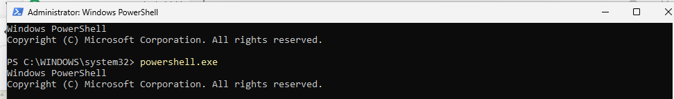
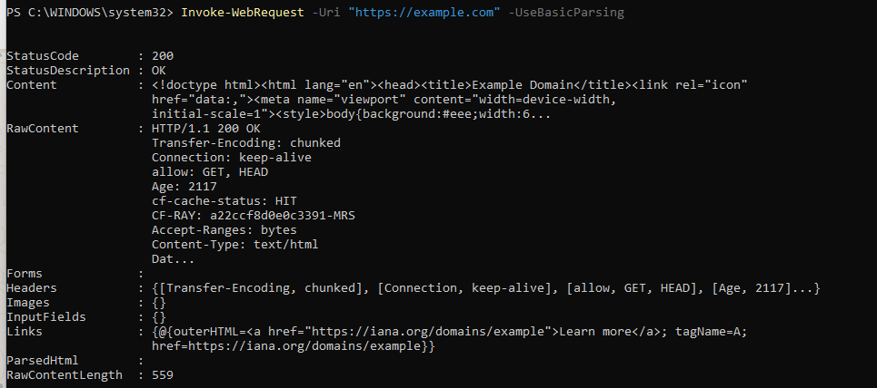
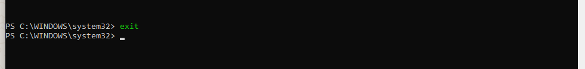
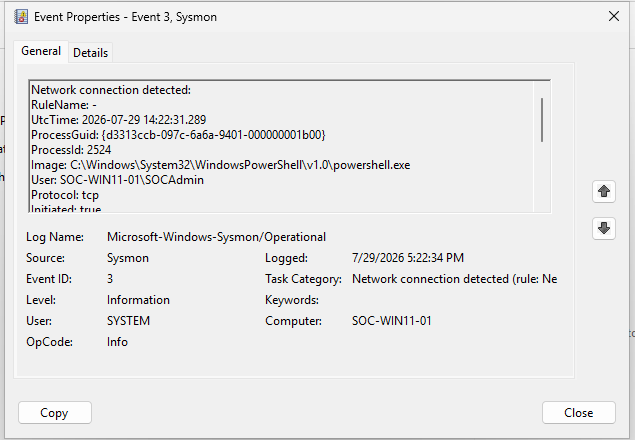
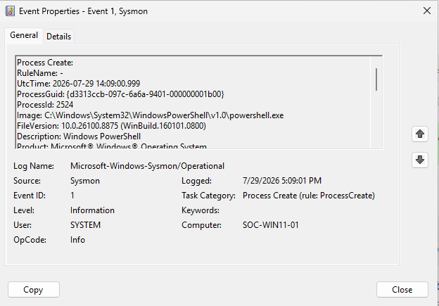
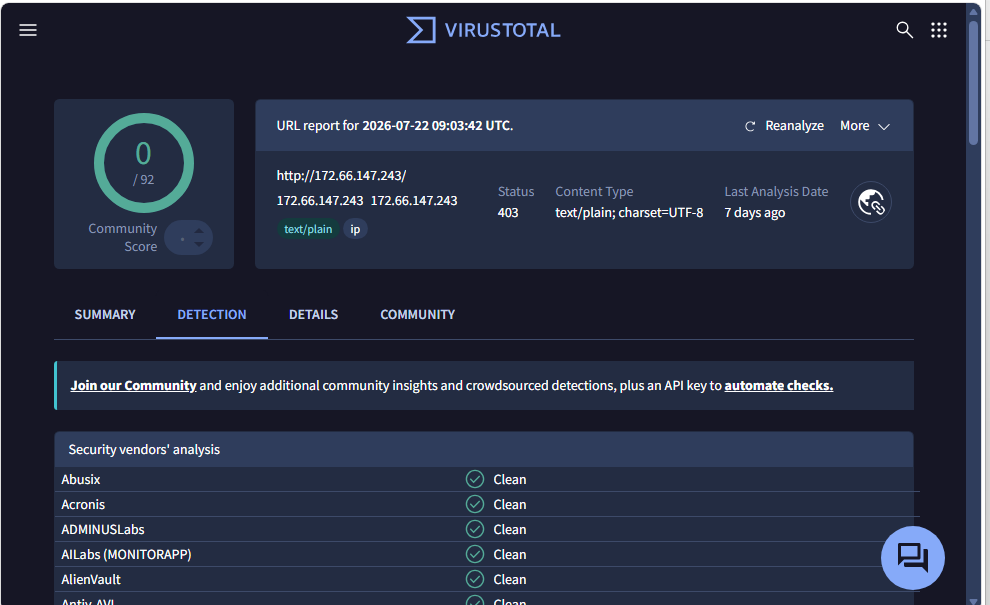

# Session 10 — PowerShell Network Activity Investigation (SOC-0002)

**Date:** 29 July 2026

---

# Objective

Investigate outbound PowerShell network activity by correlating Sysmon Process Creation and Network Connection events, then validate the destination using threat intelligence.

---

# Overview

This session focused on analyzing PowerShell network activity generated during a simulated SOC alert.

The investigation correlated Process Creation with Network Connection telemetry and validated the destination IP using VirusTotal to determine whether the observed communication represented malicious behavior.

---

# Lab Activities

## Step 1 — Generate Activity

Executed PowerShell.

Generated outbound HTTPS traffic using:

```
Invoke-WebRequest
```

---

## Step 2 — Network Investigation

Reviewed Sysmon Event ID 3.

Collected:

- Image
- Destination IP
- Destination Port
- User
- ProcessGuid

Verified that PowerShell initiated the outbound HTTPS connection.

---

## Step 3 — Process Correlation

Reviewed Event ID 1.

Matched the ProcessGuid.

Confirmed that the same PowerShell process generated the outbound network activity.

---

## Step 4 — Threat Intelligence

Submitted the destination IP to VirusTotal.

Result:

- Detection Score: **0 / 92**
- Reputation: **Clean**

No malicious indicators were identified.

---

## Step 5 — Timeline Reconstruction

| Time (UTC) | Event ID | Description |
|------------|----------|-------------|
| 15:12:11 | 1 | PowerShell process started |
| 15:13:44 | 3 | HTTPS connection established |

---

## Step 6 — Analyst Assessment

Observed behavior:

- PowerShell execution
- HTTPS outbound communication

No evidence of:

- Registry persistence
- File dropping
- Malware execution
- Suspicious destination

Final assessment:

**Risk Level:** Low

The destination IP was confirmed as clean through threat intelligence, and the observed activity appeared consistent with legitimate administrative usage.

The investigation confirmed that the observed activity was intentionally generated within the SOC lab and did not require incident escalation.

---

# Investigation Result

**Alert ID:** SOC-0002

**Classification:** Benign Activity

The PowerShell process generated outbound HTTPS traffic toward a trusted destination. Threat intelligence validation confirmed that the destination IP had no malicious reputation.

---

# Screenshots

### Screenshot 01 — Launch PowerShell



---

### Screenshot 02 — Generate PowerShell Network Connection



---

### Screenshot 03 — Close PowerShell



---

### Screenshot 04 — Event ID 3 (PowerShell Network Connection)



---

### Screenshot 05 — Event ID 1 (Process Create)



---

### Screenshot 06 — VirusTotal IP Reputation



---

# Skills Practiced

- Network Investigation
- PowerShell Analysis
- Event Correlation
- Threat Intelligence
- VirusTotal
- Incident Reporting

---

# Lessons Learned

- Event ID 3 should always be correlated with Event ID 1.
- Reputation analysis is an important step before escalating network alerts.
- Threat intelligence strengthens analyst confidence during investigations.
- Evidence should always support the final incident classification.

---

# Session Outcome

✅ Completed SOC-0002 investigation.

✅ Correlated PowerShell execution with network activity.

✅ Validated destination IP reputation.

✅ Produced an evidence-based investigation report.

---

# Next Session

- Investigate a complete multi-event PowerShell scenario.
- Correlate Process Creation, File Creation, Network Activity, and Registry events.
- Produce the final SOC investigation for this lab phase.