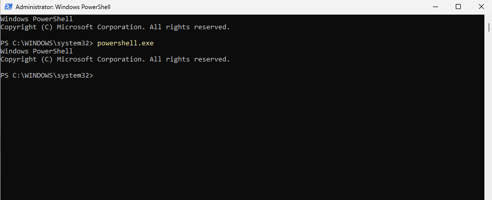
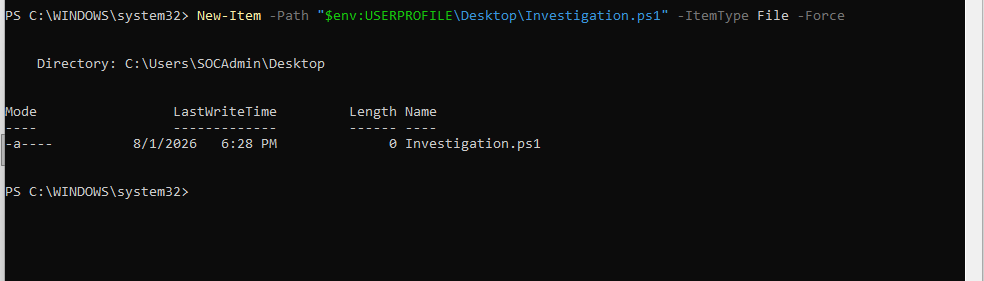
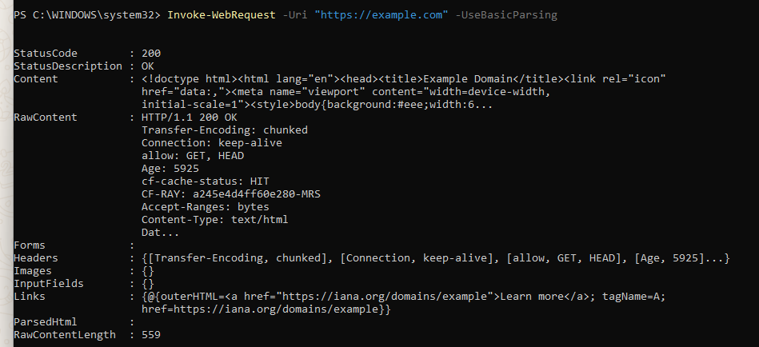
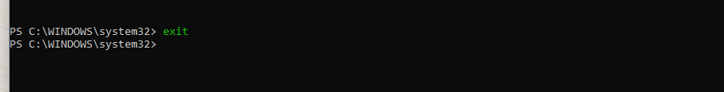
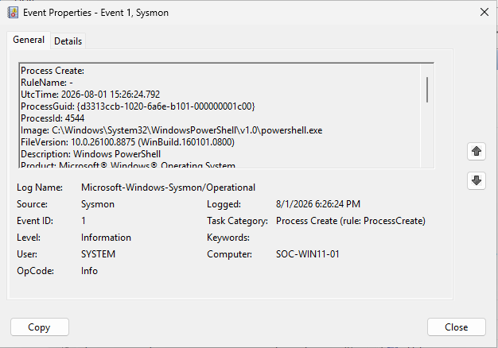
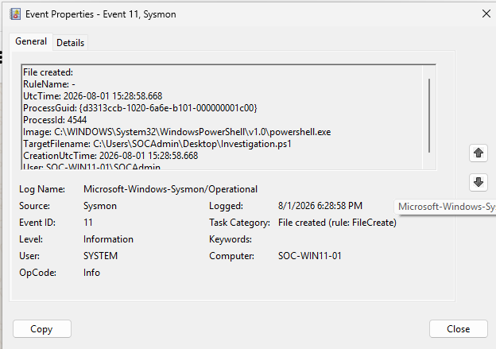
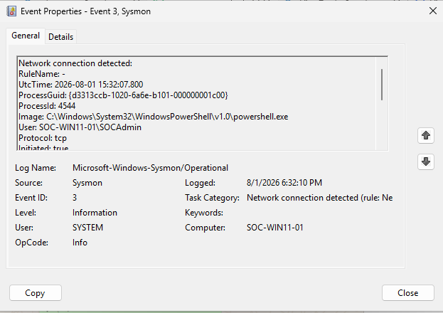
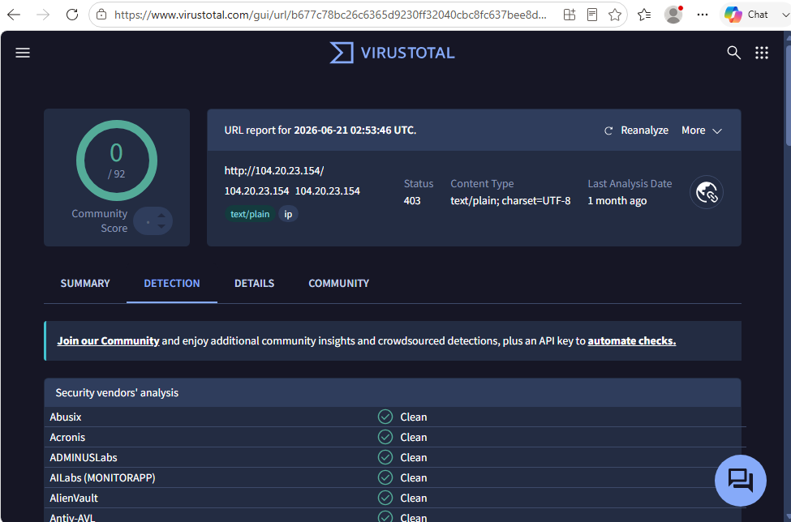
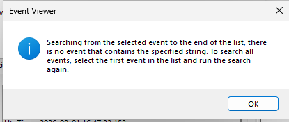

# Session 11 — Multi-Event PowerShell Investigation (SOC-0003)

**Date:** 01 August 2026

---

# Objective

Perform a complete analyst-driven investigation by correlating PowerShell process activity with file creation, network communication, and Registry telemetry to determine whether the observed behavior represents malicious activity.

---

# Overview

This session represented the first complete SOC investigation within the Windows SOC Lab.

Rather than focusing on a single Sysmon event, the investigation correlated multiple telemetry sources to reconstruct the full activity of a PowerShell process and determine whether escalation was required.

The investigation followed the same methodology commonly used by SOC analysts in real-world environments.

---

# Lab Activities

## Step 1 — Process Investigation

Reviewed Sysmon Event ID 1.

Collected:

- Image
- ParentImage
- User
- ProcessGuid

Confirmed that PowerShell execution was initiated by the logged-on user.

---

## Step 2 — File Investigation

Reviewed Event ID 11.

Verified that PowerShell created:

```
Investigation.ps1
```

Collected:

- Image
- TargetFilename
- User

---

## Step 3 — Network Investigation

Reviewed Event ID 3.

Identified outbound HTTPS communication.

Collected:

- Destination IP
- Destination Port
- Image
- User

Destination IP:

```
104.20.23.154
```

---

## Step 4 — Threat Intelligence

Validated the destination IP using VirusTotal.

Result:

- Detection Score: **0 / 92**
- Reputation: **Clean**

No malicious indicators were identified.

---

## Step 5 — Registry Investigation

Reviewed Event ID 13.

Result:

No Registry persistence or Registry modification events were associated with the investigated ProcessGuid.

---

## Step 6 — Event Correlation

Correlated all Sysmon events using the ProcessGuid.

Timeline:

| Time (UTC) | Event ID | Description |
|------------|----------|-------------|
| 15:26:24 | 1 | PowerShell process started |
| 15:28:58 | 11 | Investigation.ps1 created |
| 15:32:07 | 3 | HTTPS connection established |

---

## Step 7 — Analyst Assessment

Observed behavior:

- PowerShell execution
- PowerShell script creation
- HTTPS communication

No evidence of:

- Registry persistence
- Malware execution
- Privilege escalation
- Lateral movement

Threat intelligence confirmed that the destination IP was clean.

Final assessment:

**Risk Level:** Low

The collected evidence supports legitimate administrative activity.

The investigation confirmed that the observed activity was intentionally generated within the Windows SOC Lab for validation purposes and did not require incident escalation.

---

# Investigation Result

**Alert ID:** SOC-0003

**Classification:** Benign Activity

PowerShell executed successfully, created a script, and established an outbound HTTPS connection to a destination with a clean reputation. No persistence mechanisms or additional suspicious behavior were identified during the investigation.

---

# Screenshots

### Screenshot 01 — Launch PowerShell



---

### Screenshot 02 — Create Investigation.ps1



---

### Screenshot 03 — Generate Network Connection



---

### Screenshot 04 — Close PowerShell



---

### Screenshot 05 — Event ID 1 (Process Create)



---

### Screenshot 06 — Event ID 11 (File Create)



---

### Screenshot 07 — Event ID 3 (Network Connection)



---

### Screenshot 08 — VirusTotal IP Reputation



---

### Screenshot 09 — Event ID 13 (No Registry Activity)



---

# Skills Practiced

- Process Investigation
- File Investigation
- Network Investigation
- Event Correlation
- Threat Intelligence
- Timeline Reconstruction
- Incident Reporting
- SOC Investigation Methodology

---

# Lessons Learned

- Multi-event correlation provides significantly stronger evidence than analyzing isolated logs.
- Threat intelligence validation helps reduce false positives.
- Registry persistence should always be verified during PowerShell investigations.
- Evidence-based analysis improves investigation quality and supports accurate incident classification.

---

# Session Outcome

✅ Completed SOC-0003 investigation.

✅ Correlated Process Creation, File Creation, and Network Connection events.

✅ Validated destination reputation using VirusTotal.

✅ Confirmed the absence of Registry persistence.

✅ Produced a complete analyst-style incident report.

---

# Phase Completion

The Windows SOC Lab foundation has now been completed successfully.

The lab includes:

- Windows 11 endpoint deployment
- Sysmon installation and configuration
- Process monitoring
- File monitoring
- Registry monitoring
- Network monitoring
- Threat Hunting
- Multi-event correlation
- SOC-style incident investigations
- Investigation reporting

The environment is now ready for advanced attack simulations and more realistic incident response scenarios.