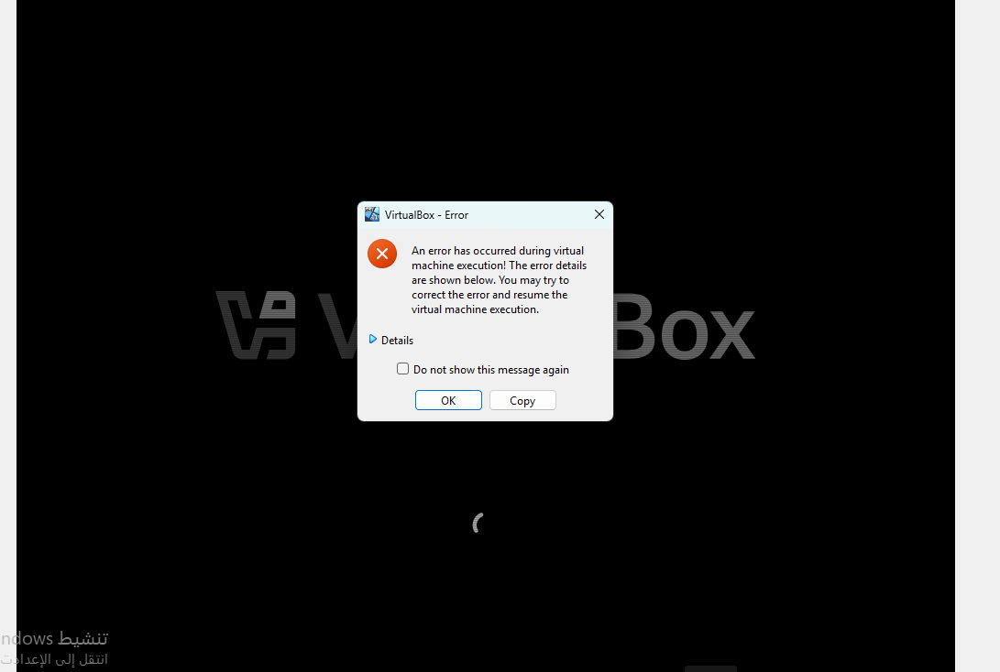
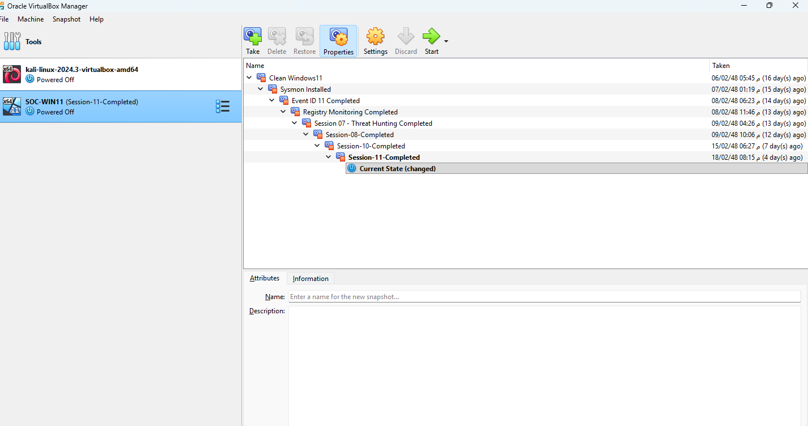
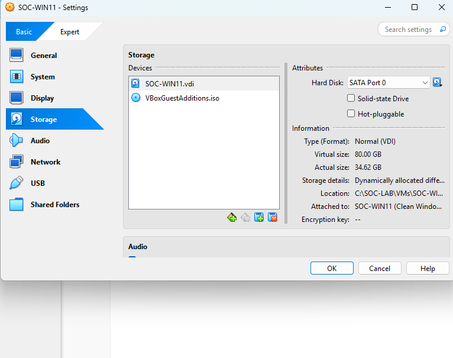
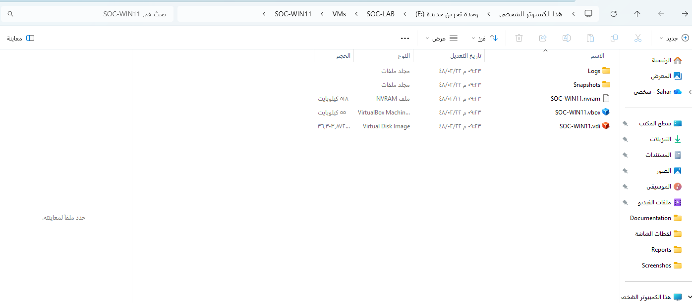
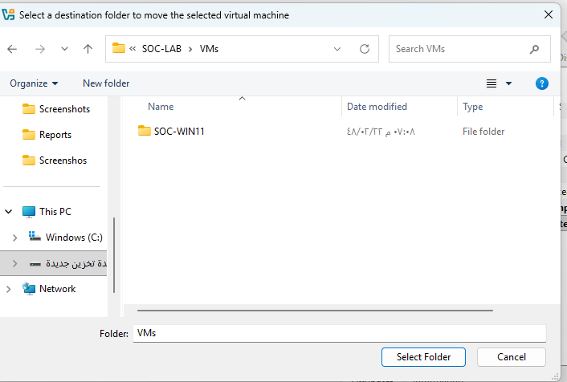
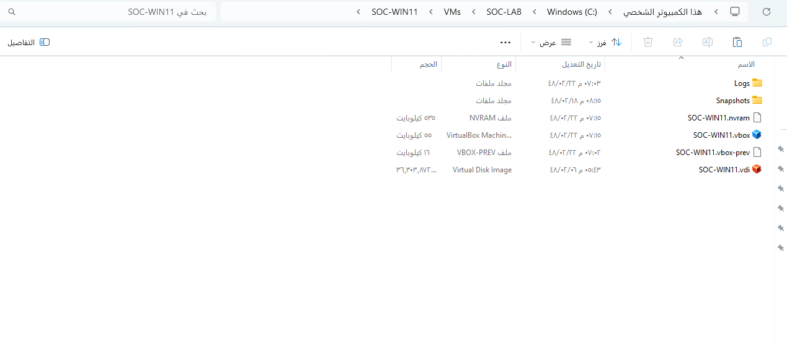
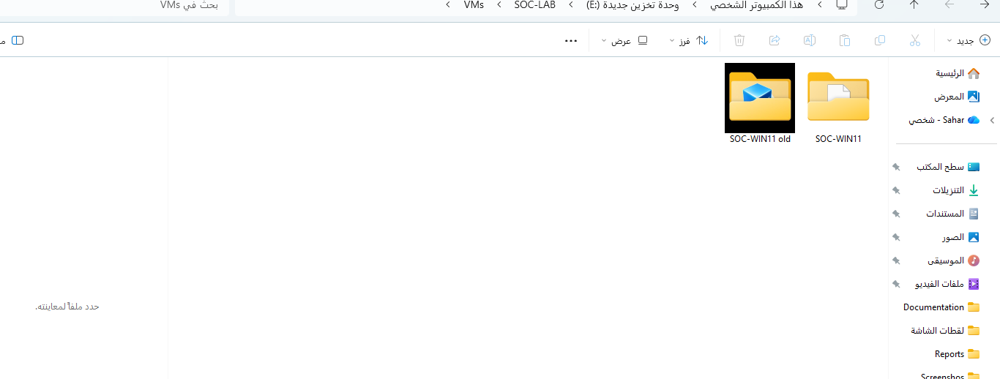

# Session-12 — Virtual Machine Recovery & Migration

**Date:** 05 August 2026

---

# Objective

Recover the Windows SOC Lab after a VirtualBox storage failure and successfully migrate the virtual machine to a dedicated storage drive using VirtualBox's official migration feature.

---

# Overview

This session documents the recovery of the Windows SOC Lab after a storage-related failure prevented the virtual machine from booting correctly.

The recovery process included identifying the root cause, restoring the latest healthy VirtualBox snapshot, validating the integrity of the virtual machine, and migrating the entire environment from the system drive (C:) to a dedicated storage drive (E:) using VirtualBox's built-in **Move** feature.

---

# Problem

During routine project maintenance, the host machine ran out of available disk space.

As a result:

- VirtualBox displayed critical errors.
- The virtual machine failed to boot correctly.
- Windows entered the Recovery Environment.
- Startup Repair could not recover the operating system.
- Virtual machine configuration files became separated from the virtual disk during troubleshooting.

### Screenshot 01 — VirtualBox Critical Error



---

### Screenshot 02 — Snapshot Recovery



---

### Screenshot 03 — VM Storage Configuration



---

### Screenshot 04 — VM Files Verified



---

### Screenshot 05 — Select Migration Destination



---

### Screenshot 06 — VM Migrated to Drive E



---

### Screenshot 07 — VM Migration Completed


---

# Validation

The following components were successfully verified after recovery:

- Windows boot
- Virtual machine configuration
- Virtual disk integrity
- VirtualBox snapshots
- Sysmon Operational Log
- Windows Event Viewer

---

# Incident Timeline

```text
Host storage became full
        ↓
VirtualBox critical error
        ↓
Recovery investigation
        ↓
Snapshot restored
        ↓
Windows boot successful
        ↓
VM migrated to Drive E
        ↓
Environment validated
```

---

# Root Cause Analysis

## Root Cause

The host drive (**C:**) ran out of available storage space, preventing VirtualBox from writing correctly to the virtual disk.

## Impact

- Virtual machine boot failure
- Windows Recovery Environment
- Startup Repair failure
- Temporary interruption of the SOC lab

## Resolution

Recovered the virtual machine using the latest healthy VirtualBox snapshot and migrated the complete environment to a dedicated storage drive using VirtualBox's official migration feature.

---

# Skills Demonstrated

- VirtualBox Administration
- Snapshot Management
- Virtual Machine Recovery
- Root Cause Analysis
- Disaster Recovery
- Storage Management
- Virtual Machine Migration
- System Validation
- Incident Documentation

---

# Lessons Learned

- Always monitor available host storage before performing major lab changes.
- VirtualBox snapshots significantly simplify recovery.
- Use VirtualBox's official **Move** feature instead of manually moving virtual machine files.
- Validate all critical services after every recovery or migration.
- Store virtual machines on a dedicated storage drive whenever possible.

---

# Session Outcome

✅ Successfully recovered the Windows SOC Lab.

✅ Restored the latest healthy VirtualBox snapshot.

✅ Verified Windows, Sysmon, and Event Viewer functionality.

✅ Successfully migrated the virtual machine from **C:** to **E:**.

✅ Preserved all snapshots and virtual machine configuration.

✅ Improved the overall reliability of the Windows SOC Lab infrastructure.

---

# Next Session

Deploy centralized log collection and continue expanding the Windows SOC Lab with advanced detection and monitoring capabilities.